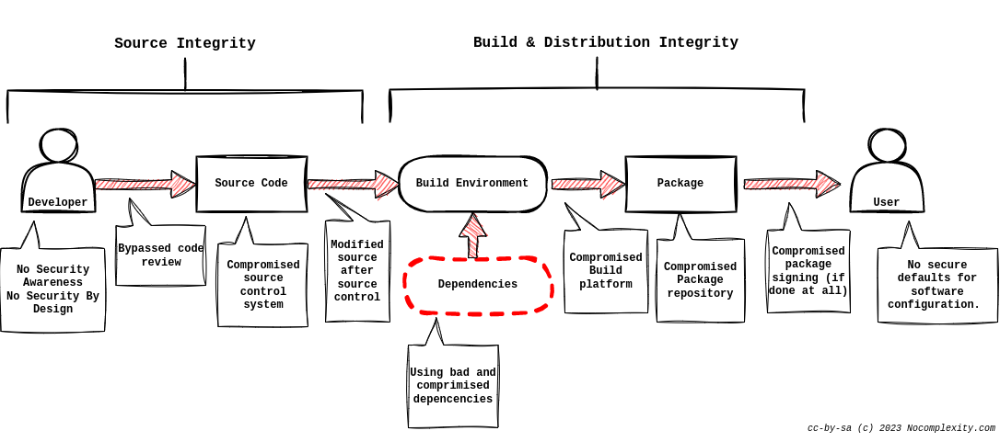

# Secure Development Life Cycle (SDLC) 

Information security must be built into every phase of the SDLC.  Failure to identify security risks and implement proper controls will result in inadequate security, potentially putting entities at risk.


:::{admonition} Definition of Security by Design SDLC
:class: tip, dropdown
The Security by Design SDLC means integrating security and all security related activities into an existing development process.
:::

The Secure Software Development Lifecycle (SSDLC) refers to a process that streamlines development from inception to release. This applies to hardware, software and other product development projects.

It’s an easy-to-follow step by step procedural model that enables organizations to:

* Develop a product in a timely manner;
* Reinforcing the product’s timeline of initial planning;
* Designing, and eventual deployment;


The secure software development life cycle is a step-by-step process to develop a more secure product with several objectives, including:

* Scalably streamlining the product/software pipeline and
* Optimising the design, deployment, and maintenance.


## Minimum SDLC activities


An overview of the SDLC is given in the figure below.





At a minimum, an SDLC must contain the following security activities:
1.	 Define Security Roles and Responsibilities
2.	 Orient Staff to the SDLC Security Tasks
3.	 Establish a System Criticality Level
4.	 Classify Information
5.	 Establish System Identity Credential Requirements
6.	 Establish System Security Profile Objectives
7.	 Create a System Profile
8.	 Decompose the System
9.	 Assess Vulnerabilities and Threats
10.	 Assess Risks
11.	 Select and Document Security Controls
12.	 Create Test Data
13.	 Test Security Controls
14.	 Perform Certification and Accreditation
15.	 Manage and Control Change
16.	 Measure Security Compliance
17.	 Perform System Disposal


From a security point of view integrating security test and validating results with expectations is a core element within the SLDC as needed for applying Security by Design.


```{tip} Learn more
Learning more about applying the SDLC means doing it in practice. But if you like to read more information there are plenty of good articles and papers available. See e.g. [OWASP blog on SDLC](https://owasp.org/www-project-integration-standards/writeups/owasp_in_sdlc/) 

```

