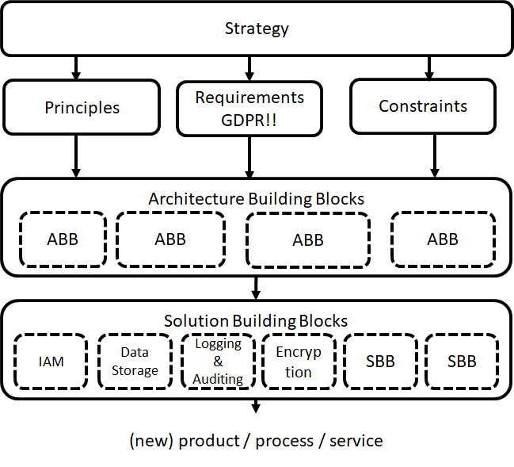

# Security Architecture

To create a sustainable solution to reduce cyber security threats is to create a solution architecture. Within this architecture you design a solution that meets your functional requirements. But this architecture is also to match design the protection measurements needed based on your risk analysis.

The perfect solution to reduce security to zero does not exist. An solution architecture helps in the process of optimizing and controlling your risks.

A good way to really speed up creating your solution architecture is of course to use this reference architecture as basis. 

A Security Architecture describes how security measurements are positioned. Measurements can be process related or be implemented by a security product such as a SIEM system.


:::{admonition} Definition of Security Architecture
:class: tip, dropdown
Security architecture has many definitions. In essence a good architecture is a set of security principles, methods and models designed to align to your objectives and help keep your organization safe from cyber threats. An architecture is not a technical design with VLANs and security zones. A Security architecture translates the business requirements to executable security requirements. 
:::


## How to create a security Architecture

A good way to really speed up creating your solution architecture is use a reference architecture as basis.

Creating security a security or privacy solution architecture consists of the following high level steps:

*    Dive in the business strategy and organization;

*   Gather security and privacy principles and requirements;

*    Determine important constraints that apply to your architecture or design. There are always constraints, e.g. time, budget, subject matter experts available etc.

*    Derive the architecture building blocks from your architecture or design. Architecture building blocks help you to scope your solution. Using architecture building blocks gives a clear view on (new) integration aspects and where completely new solutions fit in the total IT landscape.

*    Select (or create, buy) the new Solution Building Blocks. Prerequisite is of course that the functionality and technical constrains must be clear. Often prerequisites are derived from the previous design step.





## Learn more

```{tip} Learn more about creating a Security Architecture
Do not reinvent the wheel by defining your own security principles. Make use of already good defined and battle tested security principles.
In the [Open Security Reference Architecture](https://nocomplexity.com/documents/securityarchitecture/introduction.html) you can find a complete guide to speed up the process to create your own security architecture.
```
